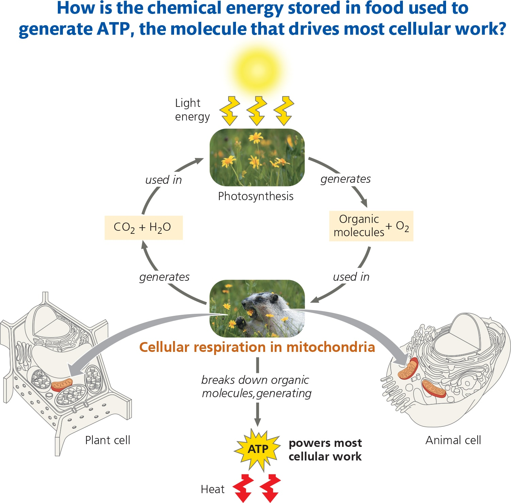
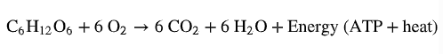
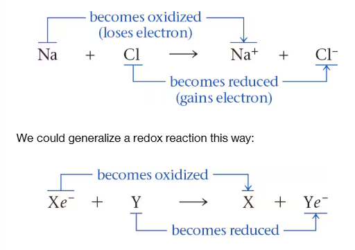

# Cell Respiration
	- {:height 658, :width 601}'
- ## Catabolic pathways
	- Outside source of energy is the sun, sun energy stored in organic molecules of food
	- **fermentation-** A catabolic process that makes a limited amount of ATP from glucose (or other organic molecules) without an electron transport chain and that produces a characteristic end product, such as ethyl alcohol or lactic acid.
	- **aerobic respiration-** A catabolic pathway for organic molecules, using oxygen (O2) as the final electron acceptor in an electron transport chain and ultimately producing ATP. This is the most efficient catabolic pathway and is carried out in most eukaryotic cells and many prokaryotic organisms.
	- **cellular respiration-** The catabolic pathways of aerobic and anaerobic respiration, which break down organic molecules and use an electron transport chain for the production of ATP.
		- Synonym for aerobic respiration because of relationship to organismal resp
	- Organic compounds + oxygen \rar Carbon dioxide + Water + Energy
	- {:height 69, :width 498}
	- This breakdown of glucose is exergonic, having a free-energy change of —686 kcal (—2,870 kJ) per mole of glucose decomposed (AG = —686 kcal/mol). Recall that a negative AG(AG < O) indicates that the products of the chemical process store less energy than the reactants and that the reaction can happen spontaneously—in other words, without an input of energy .
	- Catabolic pathways do not directly move flagella, pump solutes across membranes, polymerize monomers, perform other cellular work
- ## Redox Reactions
	- Transfer of electrons during chemical reactions
	- Relocation of electrons releases energy stored in organic molecules
- ### The Principle of Redox
	- **redox reactions-** A chemical reaction involving the complete or partial transfer of one or more electrons from one reactant to another; short for reduction-oxidation reaction.
	- **oxidation-** The complete or partial loss of electrons from a substance involved in a redox reaction.
	- **reduction-** The complete or partial addition of electrons to a substance involved in a redox reaction.
	- 
	- **reducing agent-** The electron donor in a redox reaction.
	- **oxidizing agent-** The electron acceptor in a redox reaction.
	-