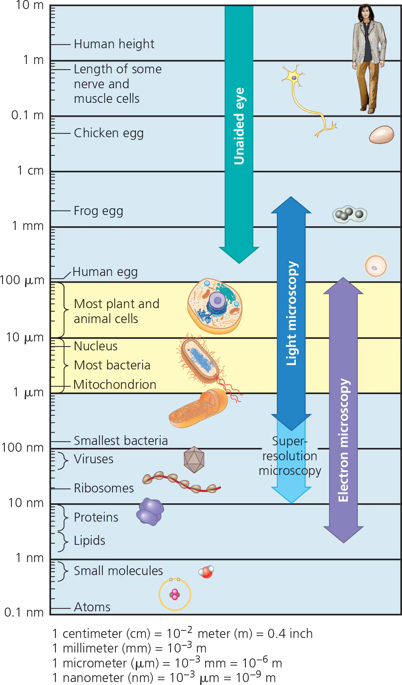
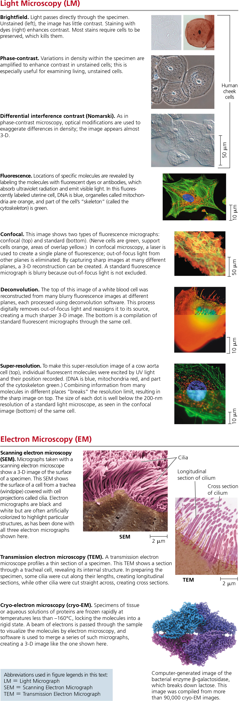
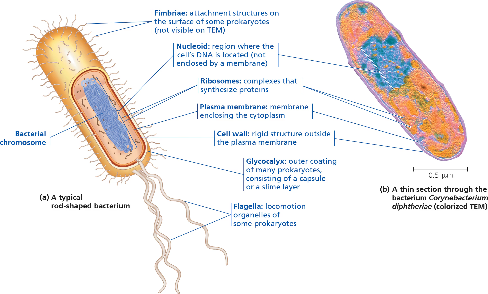
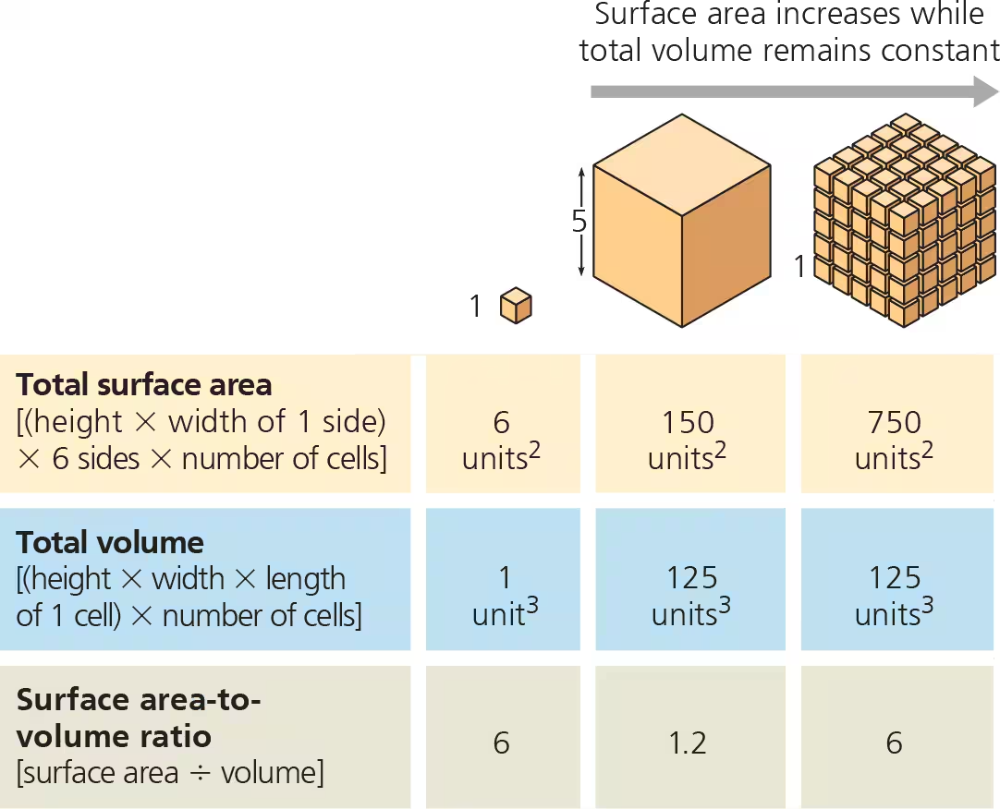
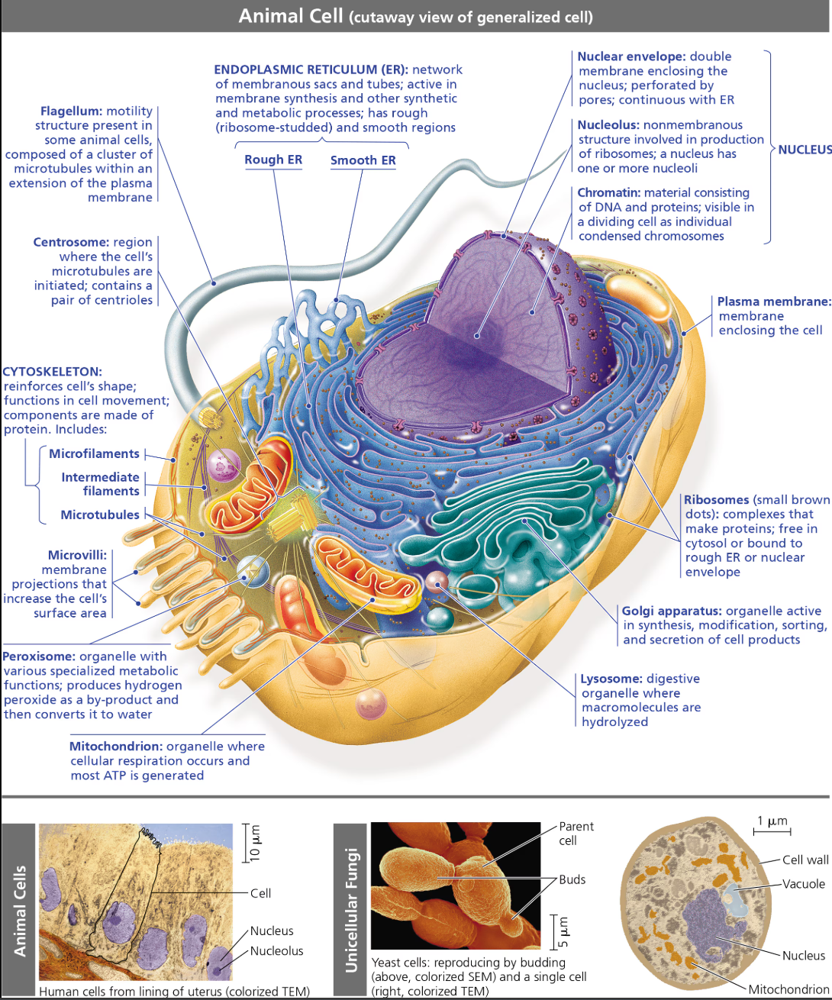
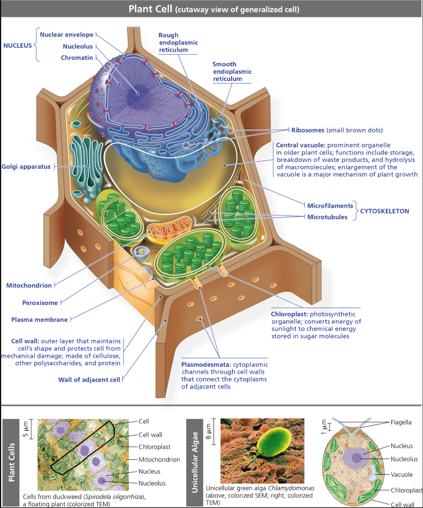
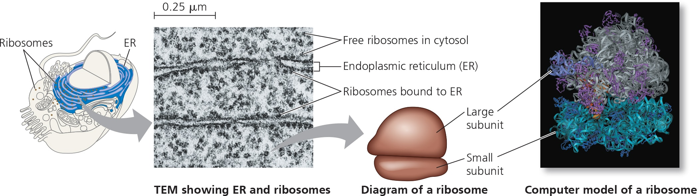
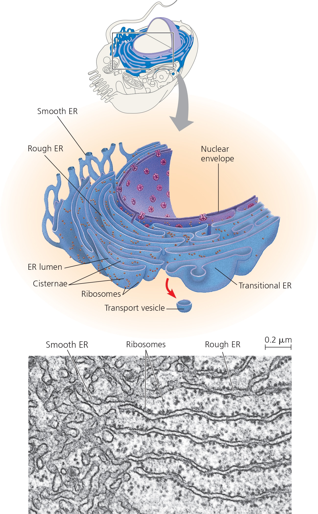
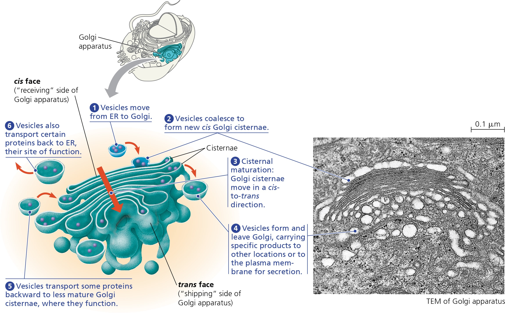

# 7.1- Microscopes
	- ## Microscopy
		- Invented in 1590
		- Refined in 1600s
		- Many microscopes- most commonly used are light microscopes
			- Visible light is passed through the specimen and then through glass lenses
		- **Magnification-** is the ratio of an objects image size to its real size
			- Light microscopes can increase magnification by approximately 1000x
		- **Resolution-** A measure of the clarity of the image; minimum distance two points can be separated and still be distinguished as separate points
		- **Contrast-** The difference in brightness between the light and dark areas of an image
		- {:height 843, :width 416}
		- {:height 1480, :width 423}
		- **Organelles-** membrane-enclosed structures within eukaryotic cells
		- **Electron microscope-** focuses a beam of electrons through the specimen of the light (or electrons)
		- **Scanning electron microscope-** especially useful for detailed study for the topography of a specimen
		- **Transmission electron microscope-** used to study the internal structure of cells
		- Increasing ability to see cells in microscope by using florescent markers
		- Increasing magnification community
		- Cyro-electron microscopy allows specimens to be preserved at extremely low temperatures
		- **Cytology-** the study of cell structure
	- ## Cell Fractionation
		- **Cell fractionation-** Takes cells apart and separates major organelles and other subcellular structures from one another
			- Centrifuge spins test tubes holding disrupted cells
- # 7.2- Internal membranes
	- ## Prokaryotic and Eukaryotic cells
		- All cells share basic features
			- Bounded by a selective barrier - *Plasma membrane*
			- **Cytosol-** semifluid, jellylike substance
			- **Chromosomes-** carry genes in the form of DNA
		- **Eukaryotic cell-** most of the DNA is in an organelle called the nucleus, bounded by a double membrane
		- **Prokaryotic cell-** DNA is concentrated in a non-membrane enclosed area
			- Concentrated in the nucleoid
		- 
		- **Cytoplasm-** refers only to region between the nucleus and the plasma membrane
		- Eukaryotic cells are generally much larger than prokaryotic cells
			- Cellular metabolism sets limits on cell size
		- **Plasma membrane-** functions as a selective barrier that allows passage of enough oxygen, nutrients and wastes to service the whole cell
		- Smaller cell has a greater ratio of surface area to volume
		- 
	- ### The Eukaryotic cell
		- Plasma membrane at its outer surface, eukaryotic cell has extensive internal membranes that divide the cell into compartments
		- Double layer of phospholipids and other lipids
		- 
		- 
- # 7.3- Genetic instructions
	- ## The nucleus
		- **Nucleus-** contains most of the genes of the eukaryotic cell
		- **Nuclear envelope-** encloses the nucleus- separates contents from the cytoplasm
		- _1773847714137_0.jpg)
		- Nuclear envelope is a double membrane
		- Membranes are seperated by 20-40nm
		- At the lip of each pore, the inner and outer membranes of the nuclear envelope are continous
		- The nuclear side of the envelope is lined by the **nuclear lamina-** netlike array of protein filaments (called intermediate filaments)
		- **Chromosomes-** DNA organization into distinct units
			- Each chromosomes contains one long DNA molecule associated with many proteins
			- Some proteins help coil the DNA molecule of each chromosome
		- **Chromatin-** The complex of DNA and proteins making up chromosomes
		- **Nucleolus-** Ribosomal RNA is synthesized from genes in DNA.
		- Nucleus directs protein synthesis by synthesizing messenger RNA that carries information from the DNA
	- ## Ribosomes
		- **Ribosomes-** complexes made of ribosomal RNAs and proteins are the cellular components that carry out protein synthesis
		- Cells with high rates of protein synthesis have particularly large numbers of ribosomes and prominent nuceoli
		- 
		- Ribosomes build proteins in two cytoplasmic regions
		- **Free ribosomes-** suspended in the cytosol
		- **Bound ribosomes-** attach to the outside of the endoplasmic reticulum or nuclear envelope
		- Both are structurally identical
		- Ribosomes generally make proteins designed for insertion into membranes
		- Cells that specialize in protein secretion-for instance, the cell of the pancreas that secrete digestive enzymes
- # 7.4- The endomembrane
	- **The endomembrane system-** includes the nuclear envelope, the endoplasmic reticulum, Golgi apparatus, lysosomes, vesicles and vacuoles and the plasma membrane
		- Carries out a variety of tasks in the cell, synthesis of proteins, transport of proteins into membranes and organelles
		- Membranes of the system are related either through direct physical continuity by the transfer of membrane segments as vesicles
	- **Vesicles-** sacs made of membrane
	- ## The Endoplasmic reticulum
		- **Endoplasmic reticulum-** an extensive network of membranes that it accounts for more than half of the total membrane in many eukaryotic cells
		- Consists of a network of membranous tubules and sacs called *cisterna*
		- The space between the two membranes of the envelope is continuous with the lumen of the ER
		- 
		- **Smooth ER-** outer surface lacks ribosomes
		- **Rough ER-** studded with ribosomes on the outer surface of the membrane and thus appears rough on ER microscopes
	- ### Functions of Smooth ER
		- Synthesis of lipids, metabolism of carbohydrates, detox of drugs and poisons, calcium ions
			- Lipids- oils, steroids and new membrane phospholipids
			- Other enzymes of the Smooth ER help detoxify drugs and proteins
		- **Glycoproteins-** proteins with carbohydrates covalently bonded to them
		- **Transport vesicles-** Vesicles in transit from one part of the cell to another
		- Rough ER is the membrane factory for the cell
	- ### The Golgi Apparatus
		- Shipping and receiving center
		- Many transport vesicles travel to the **Golgi aparatus**
		- {:height 453, :width 718}
		- Has a strict structure directionally
		- cis face
		- trans face
		- Also manufactures macromolecules
		-