- 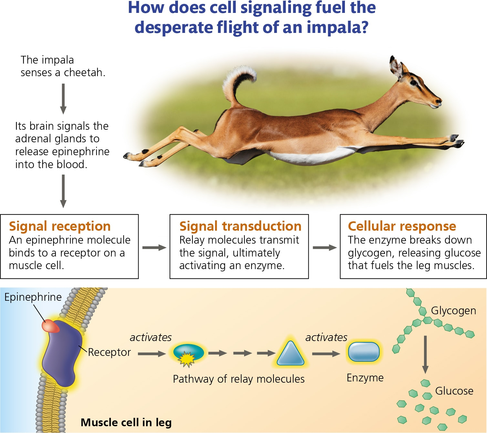
- # 9.1- External Signals and conversion to response
	- ## Evolution of cell signaling
		- 1970s research found that cells might be able to communicate with each other
		- Cell signaling is critical among prokaryotes
		- 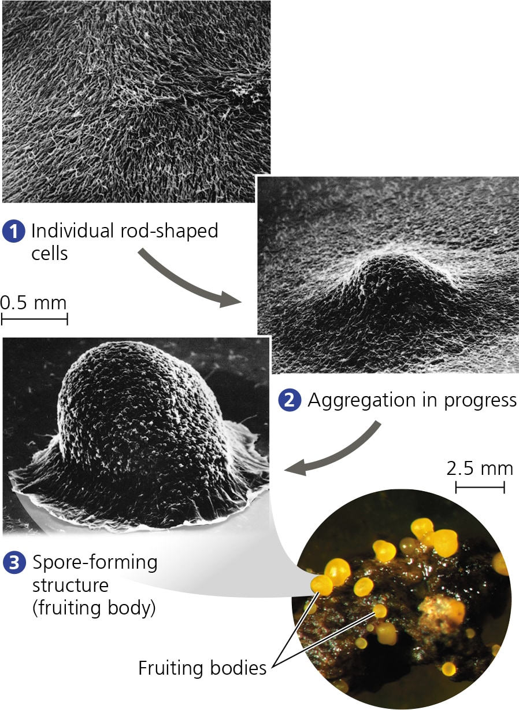
		- Quorum sensing allows bacterial populations to coordinate the behavior of all cells in population activities that require a certain amount of cells
		- Biofilm- aggregation of cells attached to a surface by molecules secreted by the cells, but after the cells have reached a certain density
		- Can also cause toxins to be excreted
		- Can also be seen in yeast cells, as cells communicate and reproduce
			- Yeast cells only breed with the same species of yeast cell
		- 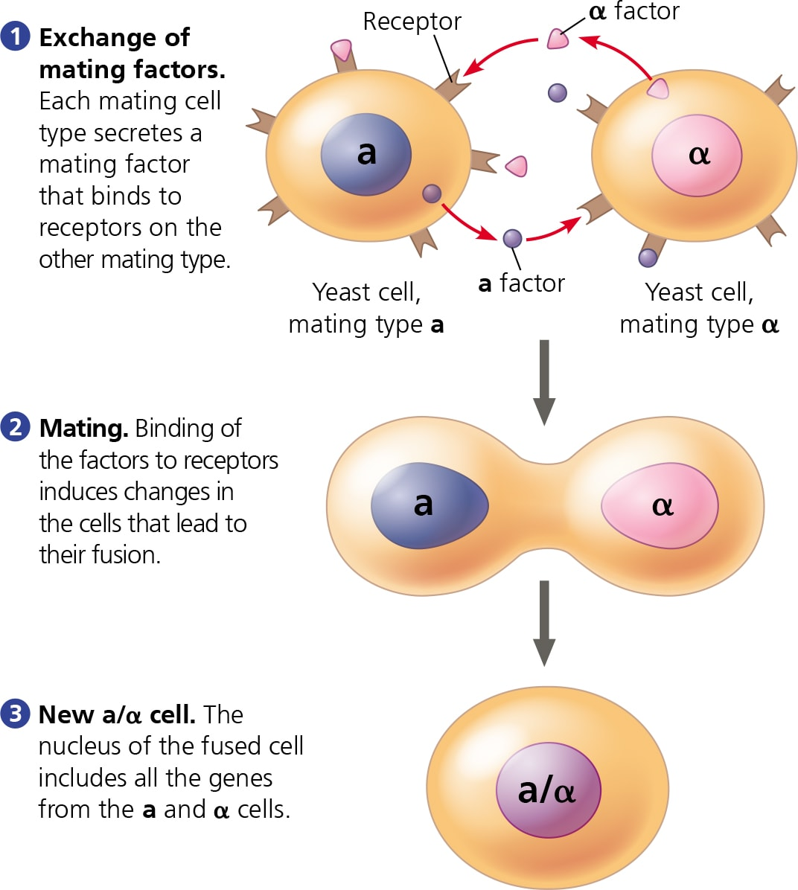
		- Three major steps: Signal reception, Signal transduction and cellular response
			- Known as a *signal transduction pathway*
			- This process is almost the same as in mammals
	- ## Local and Long-Distance Signaling
		- Cells in a multicellular organism communicate by way of a signaling molecule targeted for cells that may or may not be adjacent
		- Animal and plant cells have cell junctions that directly connect the cytoplasm's of adjacent cells
		- Important in embryonic development, immune response, and maintaining adult stem cell populations
		- 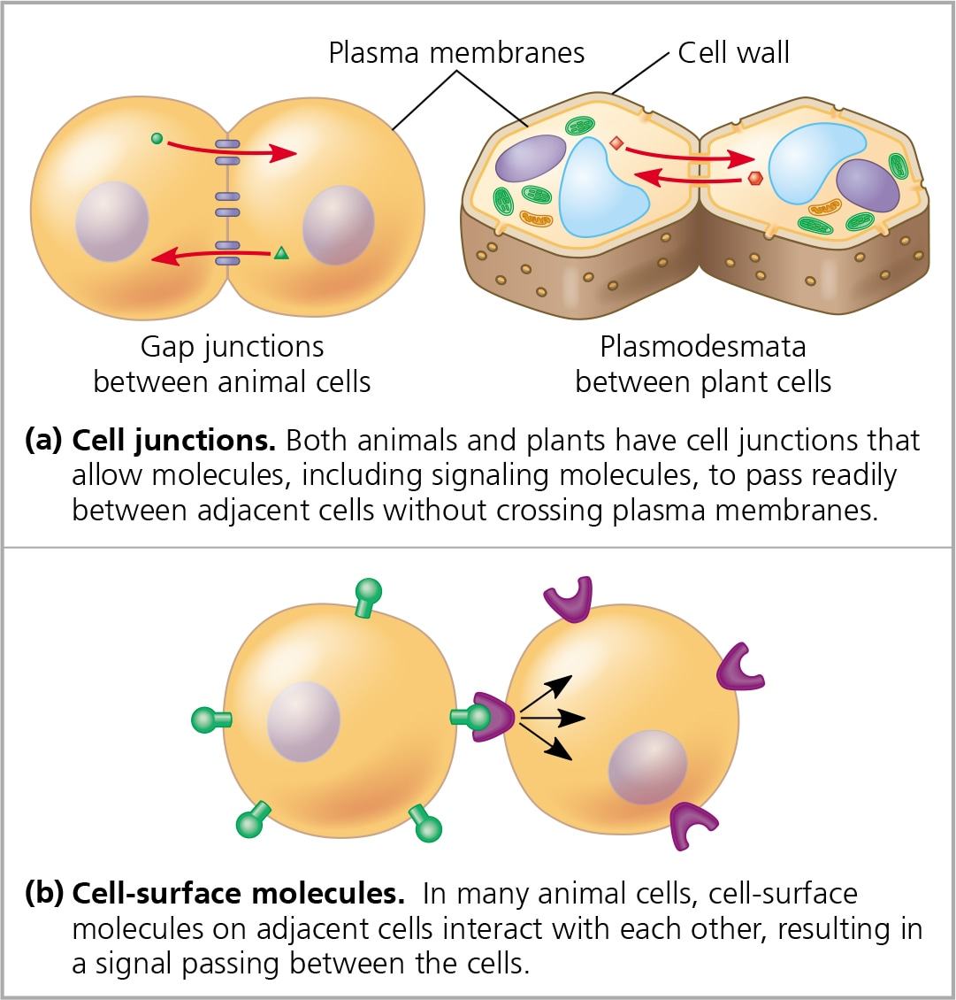
		- In some cases, signaling molecules are secreted by the signaling cell
			- Some travel only short distances - local regulators influence cells that are nearby
			- Type of local signaling in animals in *paracrine signaling*
			- *growth factors-* compounds that stimulate nearby target cells to grow and divide
		- 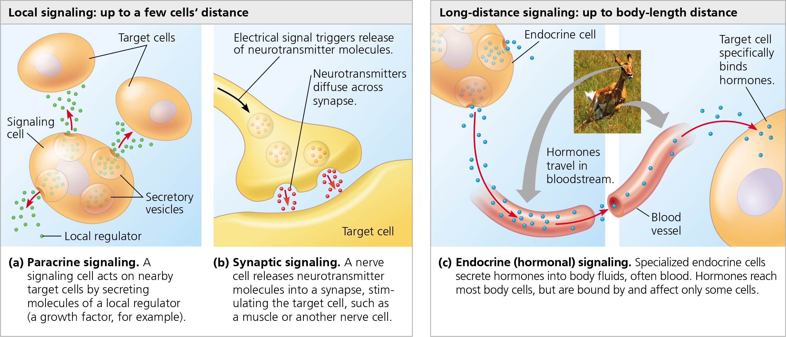{:height 297, :width 671}
		- *synaptic signaling-* electrical signal triggers neurotransmitters (synapses)
		- **Hormones-** used for long distance signalling
			- Also known as endocrine signalling
			- Travel through cells
		- Ability of the cell to respond is determined by whether it has a specific receptor molecule that can bond to a signaling molecule
	- ## Three stages of Celling signaling
		- Epinephrine - mobilize fuel reserves
			- Mobilizes glucose reserves
		- 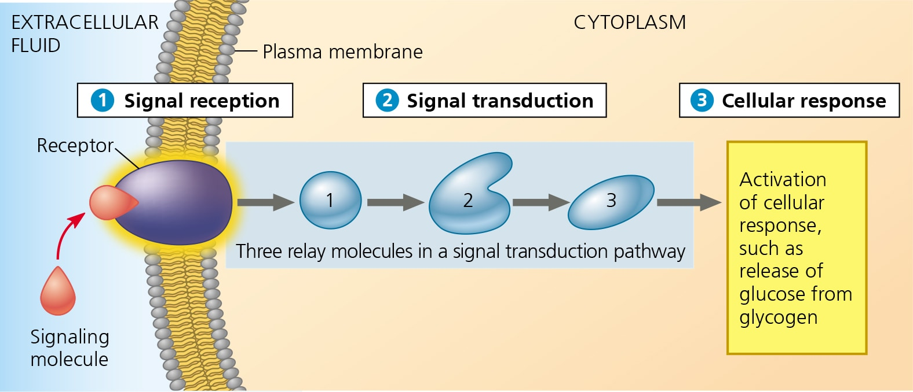
- ## Signal reception
	- Signals emitted by cells are only heard by the corresponding cells
	- Signaling molecule is complementary in shape to a specific site on the receptor
	- **Ligand-** term for a molecule that specifically bonds to another, larger molecule
	- 
	- Cell surface receptors represent 30% of all human proteins
	- Cell surface receptors tend to be flexible and inherently unstable
	- Molecular biological techniques, researchers have developed a protein called Herceptin that binds to HER2
	- ### Intercellular Receptors
		- Found in either the cytoplasm or nucleus or target cells
		- Signaling molecule passes through the cells plasma membrane
		- Aldosterone is a representative example of how steroid hormones work
		- Hormone secreted by cells of the adreno glands and enters cells all over the body
		- 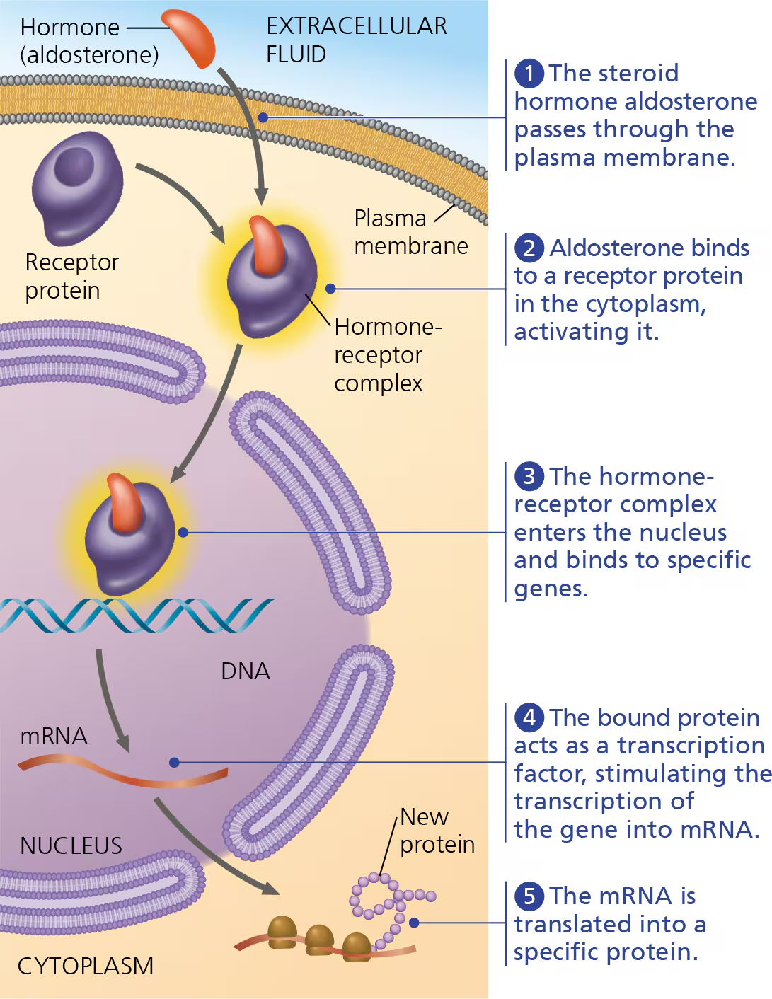
		- Cells DNA function is being transcribed and processed into mRNA, leaves the nucleus and is translated into a specific protein by ribosomes in the cytoplasm
		- Transcription factor- aldosterone receptors function in the same way- many are already in the nucleus
	- ## 9.3- Signal transduction: Cascades of molecular interactions transmit signals from receipts to relay
		- Transduction stage of cell signaling is usually a multistep pathway involving many molecules
		- Signal caused by a small number of signaling molecules is amplified by a number of steps
	- ### Signal Transduction Pathways
		- Binding of a specific signaling molecule to a receptor in the plasma membrane triggers the first step in the signal transduction pathway
		- Signal activated receptor activates another molecule and creates a chain reaction
		- Relay molecules relay signals-are often proteins
	- ### Protein Phosphorylation and Dephosphorylation
		- Concept of activating a protein by adding one or more phosphate groups to it
		- **protein kinase-** An enzyme that transfers phosphate groups from ATP to a protein, thus phosphorylating the protein.
		- **phosphorylation cascade-** A series of chemical reactions during cell signaling mediated by enzymes (kinases), in which each kinase in turn phosphorylates and activates another, ultimately leading to phosphorylation of many proteins.
		- 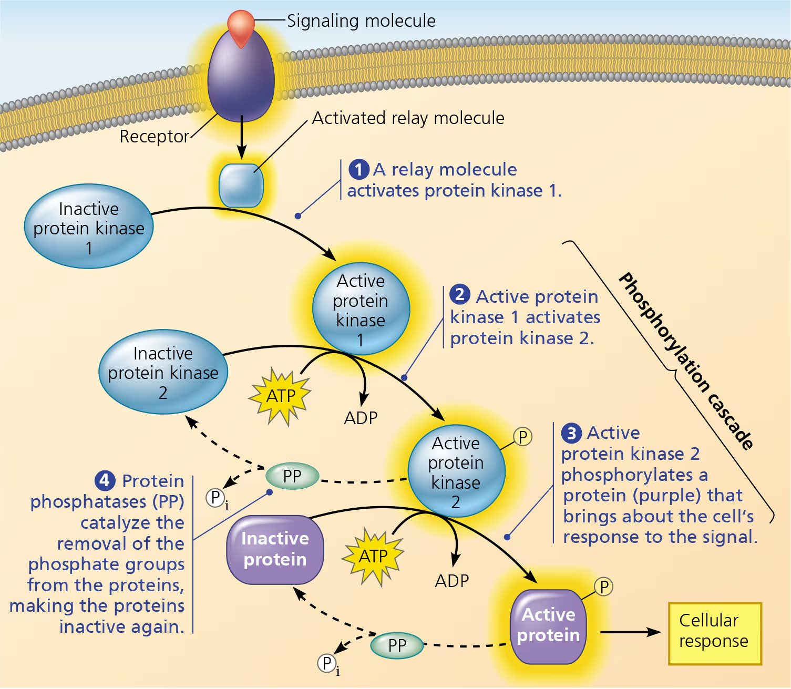
		- Significant percentage of human genes is likely code for protein kinases
			- Single cell may have hundreds of different kinds
			- Among these are the proteins that regulate cell division
		- **protein phosphatases-** An enzyme that removes phosphate groups from (dephosphorylates) proteins, often functioning to reverse the effect of a protein kinase.
		- Make the protein kinases available for reuse, enable the cell to respond to an extracellular signal
	- ### Small Molecules and Ions as
		- **second messengers-** A molecule that relays messages in a cell from a receptor to a target where an action within the cell takes place.
		- Second messengers participate in pathways that are initiated by both G coupled receptors and tyrosine kinases
		- Large variety of relay proteins respond to changes in cytosolic concentration of one or the other
	- ### Cyclic AMP
		- **cyclic AMP-** Cyclic adenosine monophosphate, named because of its ring structure, is a common chemical signal that has a diversity of roles, including as a second messenger in many eukaryotic cells, and as a regulator of some bacterial operons.
		- **adenylyl cyclase-** An enzyme that converts ATP to cyclic AMP in response to an extracellular signal.
			- Can catalyze the synthesis of many molecules of cAMP
			- Normal cell concentration of cAMP can be boosted 20 fold in a matter of seconds
			- Broadcasts the signal to the cytoplasm
		- 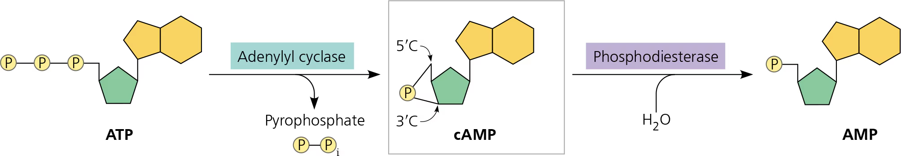{:height 124, :width 671}
		- 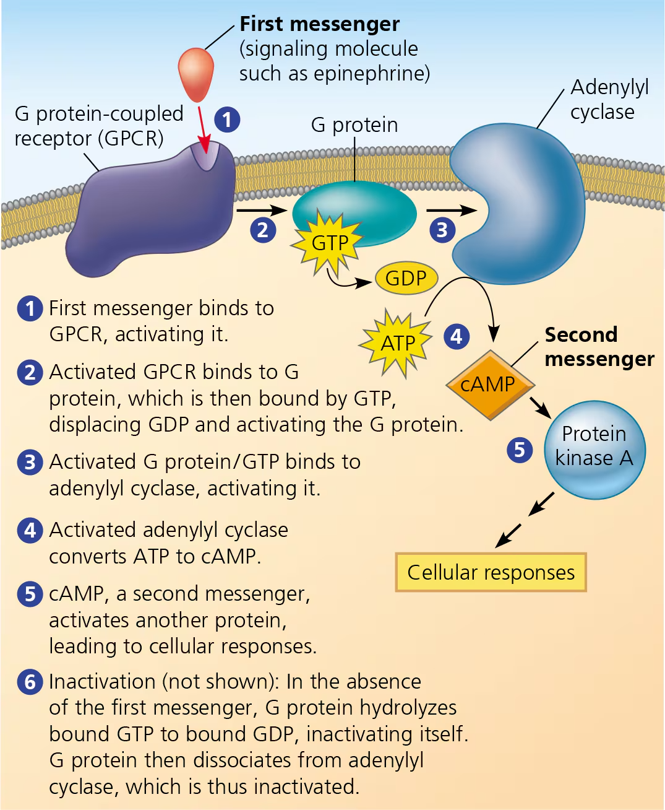
		- Ca2+ is used as a messenger
			- Ion can function as a second messenger because its concentration in the cytosol is normally much lower than its concentration outside the cell
		- 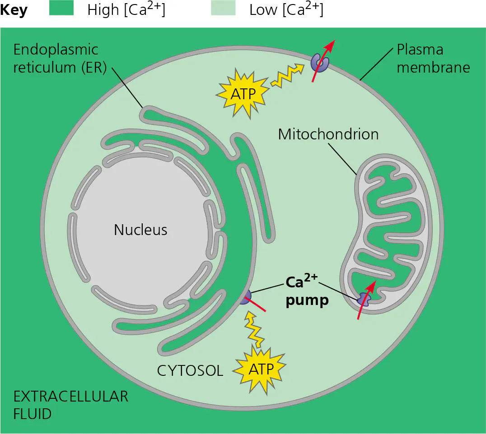
		- **inositol trisphosphate-** A second messenger that functions as an intermediate between certain signaling molecules and a subsequent second messenger, Ca2+, by causing a rise in cytoplasmic Ca2+ concentration.
		  id:: 69e081c8-e15b-464a-a1c7-9b4b00c94dce
		- **Diacylglycerol (DAG)-** A second messenger produced by the cleavage of the phospholipid PIP2 in the plasma membrane.
		- 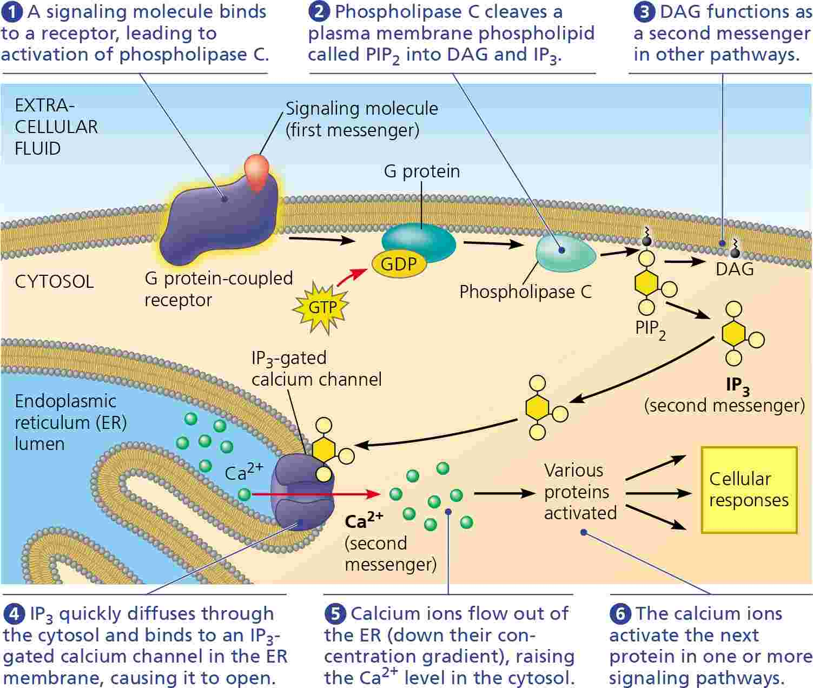
	- ## 9.4 - Cellular Response
	- ### Nuclear and Cytoplasmic responses
		- Leads to the regulation of one or more cellular activities
		- Response may occur in the nucleus or in the cytoplasm of the cell
		- Most signaling pathways regulate photosynthesis
		- Transcription factors often regulate several genes
		- 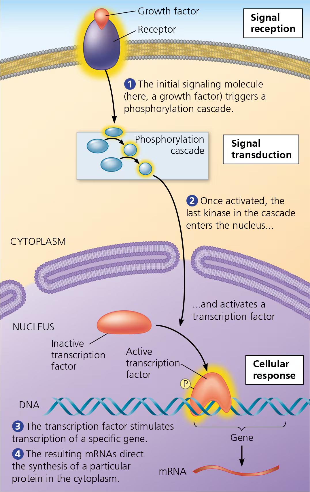
		- Signaling pathway may regulate the activity of proteins rather than causing their synthesis by activating gene expression
		- Affects proteins that function outside of the nucleus
		- 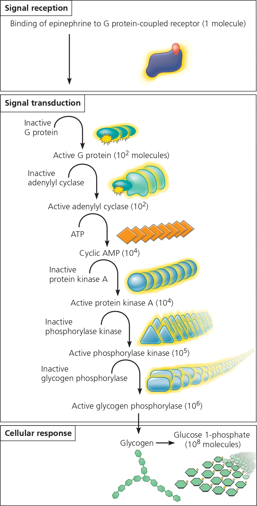
	- ## Regulation of the Response
		- Extent and the specificity of the response are regulated
			- Signaling pathways
			- Control points
			- Scaffolding proteins
			- Termination of signal
	- ### Signal Amplification
		- Amplifies the cells response to a signal
		- Amplification stems from the fact that these proteins persist in their active form long enough to process multiple molecules
	- ### Specificity of Cell Signaling and Coordination of response
		- Only the specified cell responds to the signal
		- Different kinds of cells have different collections of proteins
		- Two cells that respond different to the same signal differ in one or more proteins that respond to the signal
		- Branching pathways and cross-talk
		- 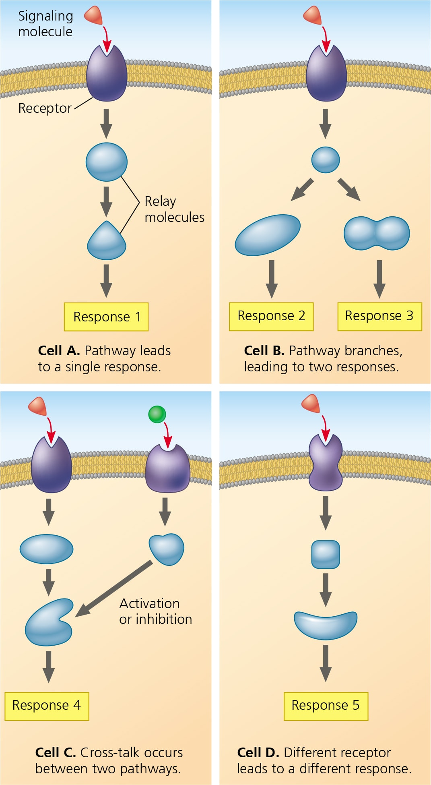
	- ### Signaling Efficiency: Scaffolding Proteins and Signaling complexes
		- Diagrams show only a few relay molecules
		- Efficiency of signal transduction is apparently increased due to scaffolding proteins
		- **scaffolding proteins-** A type of large relay protein to which several other relay proteins are simultaneously attached, increasing the efficiency of signal transduction.
		- 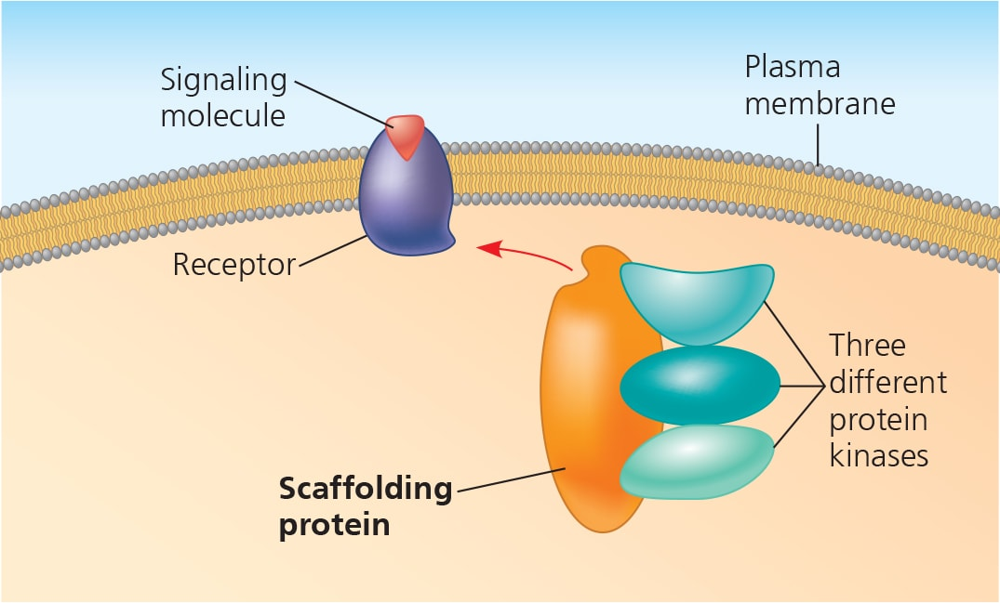
		- Multifunctional relay protein is both a branch point and an important intersection point and an important intersection point
	- ### Termination of the Signal
		- Ability of the cell to receive new signals depends on the reversibility of the changes produced by prior signals
		- Cellular response only occurs when the concentration of receptors is above a certain threshold
		- Relay molecules return to their inactive forms
		- Cell is then ready to respond to a fresh signal
	- ## Apoptosis requires integration of multiple cell-signaling pathways
		- **apoptosis-** A type of programmed cell death, which is brought about by activation of enzymes that break down many chemical components in the cell.
			- Cell shrinks and becomes lobed and the cells parts are packaged up in vesicles that are engulfed and digested by specialized scavenger cells
		- Signal that triggers all of the complex events can come from either inside the cell or outside the cell
	- ### Apoptosis in the Soil Worm
		- Apoptosis occurs 131 times during the development of the worm, at the same time for each worm
		- Death signal is received by the cell and causes it to die
		- 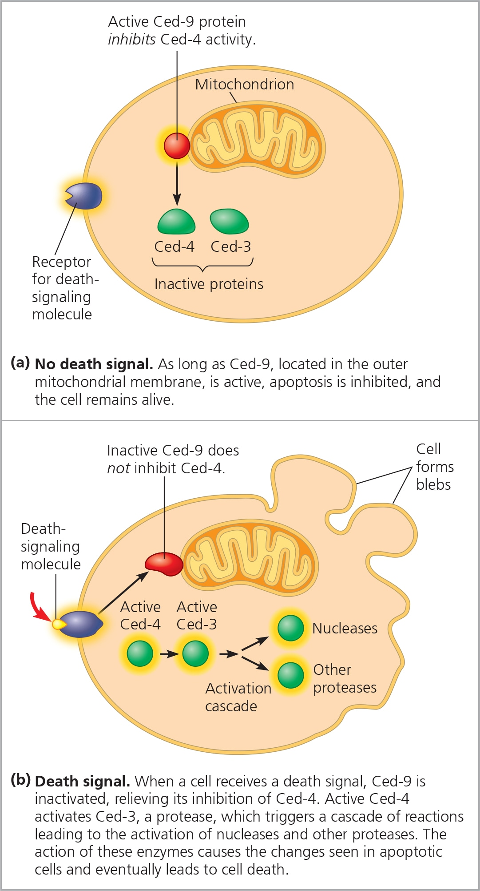
	- ### Pathways and Signals that Trigger them
		- Pathways depend on the type of cell
		- Mitochondrial proteins that are triggered to form molecular pores in the molecular pores
		- Relay proteins integrate from many different sources and can send a cell during an apoptotic pathway
		- One signal comes from the nucleus and another comes from the endoplasmic reticulum
		- Essential to the development/ health in all animals
		- 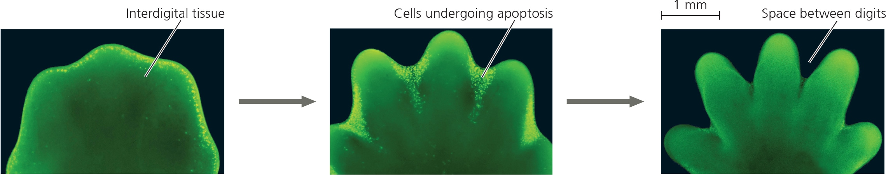
		- Belief that Apoptosis may occur prematurely and cause degenerative diseases such as alzheimers and dementia
		-
-