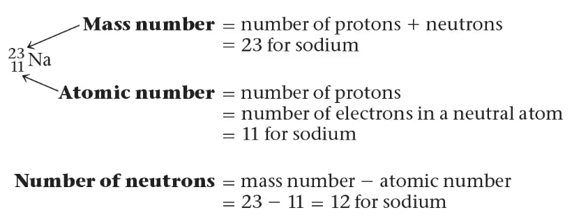
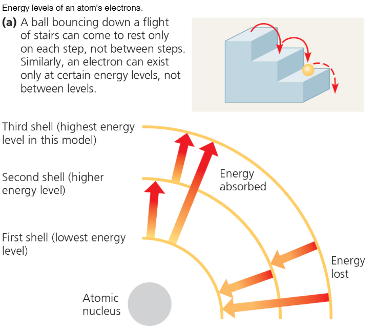
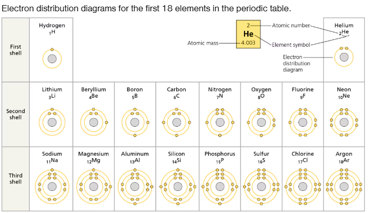

## Elements and Compounds
	- Matter is made up of elements
	- Recognize 92 elements occurring in nature
		- Gold
		- Copper
		- Carbon
		- Oxygen
	- Compound is a substance consisting of two or more different elements combined in a fixed ratio
- ### The elements of life
	- 92 natural elements
	- Elements that an organism needs to live a healthy life and reporduce
	- Humans need 25 elements but plants need only 17
	- Oxygen, Carbon, Hydrogen, and Nitrogen make up approx. 95% of living matter
	- Some naturally occurring elements
- ### Elements properties depend on the structure of atoms
	- #### Subatomic particles
		- Atom is the smallest unit having the properties of an element
		- Neutron, proton, electrons
		- Neutron and proton are almost identical in mass
		- Atomic number tells us how many protons are in an items nucleus
		- 
	- #### Isotopes
		- Different atomic forms of the same element are isotypes
		- Can also be used as tools in medicine
		- Radioactive tracers can be used in medicine to track if certain diseases exist
	- #### Radioactive items
		- Can measure the decay in fossils to date these relics of a past life
		- Parent isotope decays into its daughter isotype at a fixed rate
			- Known as the half life
	- #### The energy level of electrons
		- **Energy** - The capacity to cause change
		- **Potential energy** - the energy that matter posses because of its location and structure
		- Electrons of an atom have potential energy due to the distance to the nucleus
		- 
		- Electrons are found in different electron shells - each with a characteristic average distance and energy level
		- An electron can move from one shell to another
			- When an electron absorbs energy it moves to a shell farther out from the nucleus
	- #### Electron Distribution and Chemical properties
		- Chemical behavior of an atom is determined by the distribution of electrons in the atoms electron shells
		- 
	- #### Electron orbitals
		- We can not truly know where the atom is located
		- Electron shell contains electrons at a particular energy level
		- Orbital is a component of an electron shell
- ### The formation and function of molecules and iconic compounds
	- Atoms with incomplete valence shells can interact with other atoms in order to complete the valence shell
	-