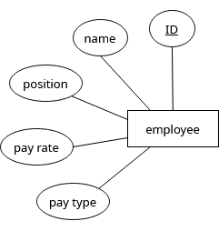
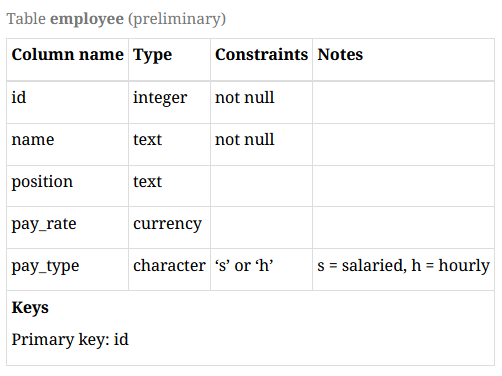
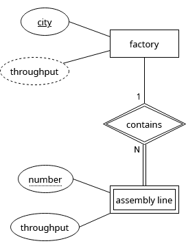
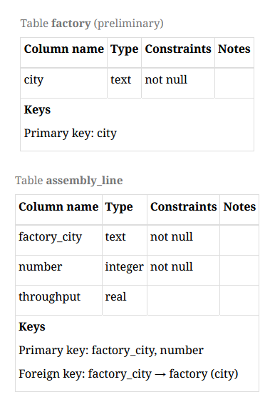
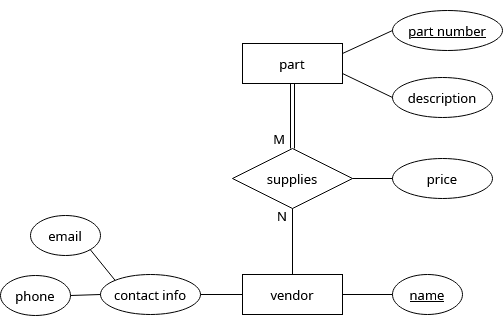
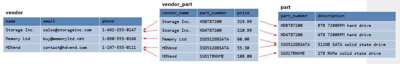
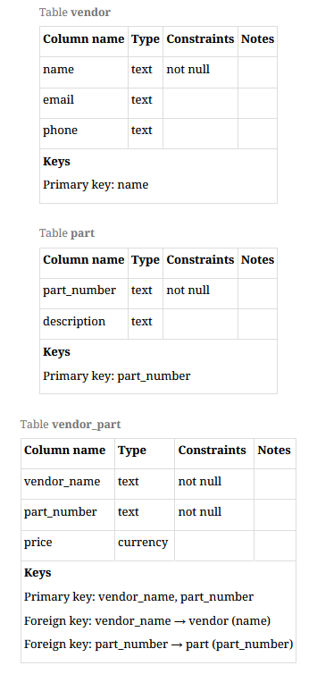

- [[@2.3. Converting ERD to a relational model — A Practical Introduction to Databases]]
- # Entities
	- First step is to make tables from each entities
	- Weak entities need different handling than regular entities
- ## Regular entities
	- Name the table \rarr does not have to be the same as the entity name
	- Choose a basic approach and be consistent
	- Some DB use plural nouns while others use singular nouns
	- #+BEGIN_EXAMPLE
	  In our data model from Chapter 2.2, the entity employee might become a table named employee or employees. Another naming issue arises with table names containing multiple words; some databases choose to run these together, while others employ underscore characters. For example, the entity assembly line could become a table named assemblyline or assembly_line.
	  #+END_EXAMPLE
	- Most attributes for the entity should be converted to columns
	- Do not create columns for derived attributes
	- Don't create columns for multivalued attributes
	- Create columns for the component attributes, not the composite ones
	- Can add constraints
	- Choose a key attribute- all should have at least one
		- Simpler primary key columns are preferred over complex ones
- ## Example
	- 
	-
	-
	- 
- ## Weak Entities
	- Converted into tables in almost same way as regular
	- No ID key attributes
	- Has a partial key, must be combined with key of parent entity
	- #+BEGIN_EXAMPLE
	  In our example, the assembly line entity is weak. Its partial key, the number of the assembly line within a particular factory, must be combined with the factory identity for full identification.
	  #+END_EXAMPLE
	- Created from weak entity must therefore incorporate the kye from parent entity as an additional column
	- Primary key for new table will be comprised of columns created from parent key and from partial
	- Column created from parent key should be constrained to always match some key in the parent table
- ### Example
	- 
	- #+BEGIN_EXAMPLE
	  Using the above guidelines, we should create tables factory and assembly_line, and include a column in assembly_line for values from the city column of factory. A good choice of name for these “borrowed” columns is to concatenate the original table and column names together; in our case, this gives us the column factory_city. (We will use the term “borrow” in reference to this process of inserting a column in one table to hold values from the primary key column of a related table.) Here is the preliminary conversion of factory and the final conversion of assembly line:
	  #+END_EXAMPLE
	- 
- # Relationships
	- Use a table for a relationship
	- Known as a cross-reference table
	- Acts as an intermediary in three-way join with two (or more tables)
	- Some cardinality ratios permit simpler solutions
- ## Many-to-Many
	- Most general type of relationship
	- #+BEGIN_EXAMPLE
	  Given a table A and a table B, we create a cross-reference table with columns corresponding to the primary keys of A and B. Each row in the cross-reference table stores one unique pairing of a primary key value from A with a primary key value from B. Each row thus represents a single connection between one row in A with one row in B. If a row in A is related to multiple rows in B, then there will be multiple entries with the same A primary key value, paired with each related B primary key value.
	  #+END_EXAMPLE
	- #+BEGIN_EXAMPLE
	  For example, our ERD indicates a many-to-many relationship between the entities vendor and part. A computer part (such as an 8TB hard drive) can come from multiple sellers, while sellers can sell multiple different computer parts:
	  #+END_EXAMPLE
	- 
	- #+BEGIN_EXAMPLE
	  We create tables vendor and part following the guidelines above, and then create the cross-reference table vendor_part. (It is common to name a cross-reference table using the names of the two tables being related, although other schemes can of course be used.) Note that the supplies relationship also has a relationship attribute, price, which we can incorporate into the cross-reference table. The result, with some fictional data, is pictured below:
	  #+END_EXAMPLE
	- 
	- #+BEGIN_EXAMPLE
	  Data in the cross-reference table is constrained in several ways. First, we only want to store the relationship between rows once, so we make the combination of primary keys from the related tables into a primary key for the cross-reference table. In our example, the primary key is the combination of vendor_name and part_number. Second, each of the borrowed primary key columns should be constrained to only hold values that are present in the original tables, using foreign key constraints.
	  
	  Table descriptions for vendor, part, and the vendor_part cross-reference table are given below:
	  #+END_EXAMPLE
	- 
- ## One to many
	-