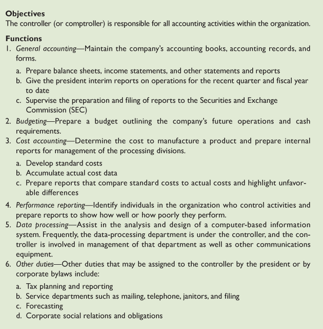
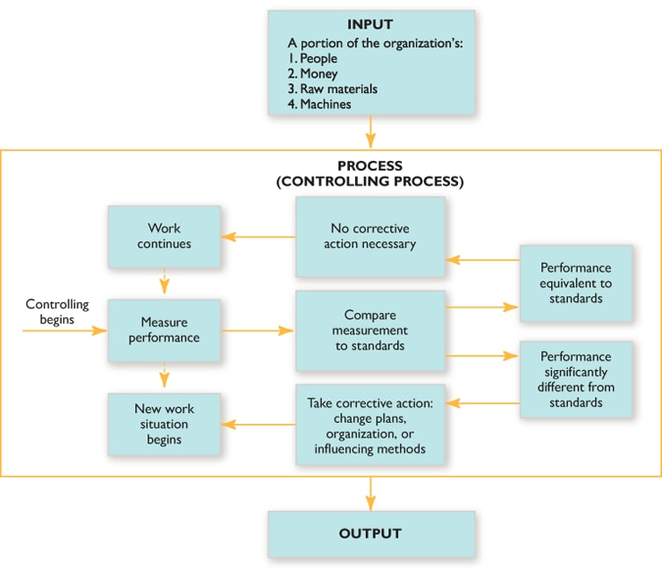

# The Fundamentals of Controlling
	- **Control-** entails ensuring that an event occurs as it was planned to occur
	- **Murphy's Law-** anything that can go wrong will go wrong
	- **Controlling-** process managers go through to control
		- Determining effectiveness of the business
- ## The controlling subsystem
	- Help managers enhance the success of the overall management system
	- 
- ## The Controlling process
	- 
- ### Measuring performance
	- Must measure current organizational performance
	- Must establish measure to gauge performance
		- What to measure- like amounts, number of tasks performed, etc
		- Production, etc
- ## Comparing measured performance to standards
	- **Standard-** the level of activity established to serve as a model for evaluating organizational performance
		- Profitability Standards - Indicate how much money the company would like to be made
		  logseq.order-list-type:: number
		- Market position standards - total sales relative to others
		  logseq.order-list-type:: number
		- Productivity standards- How much segments of the organization should produce is the focus of these standards
		  logseq.order-list-type:: number
		- Product leadership- Leadership in product fields
		  logseq.order-list-type:: number
		- Personnel development standards - Standards in this area include type of training programs that personnel should undergo
		  logseq.order-list-type:: number
		- Employee attitudes standards - Type of attitudes supposed to be imbued in employees
		  logseq.order-list-type:: number
		- Social responsibility standards- GE recognizes its responsibility to make contributions to society
		  logseq.order-list-type:: number
		- Balance between short and long range goals - Express the relative emphasis that should be place on attaining various short and long range goals
		  logseq.order-list-type:: number
- ## Taking corrective action
	- **Corrective action-** managerial activity aimed at brining organizational performance up to level of standards
	- Recognizing problems - need to take corrective action to fix
	- Recognizing symptoms - what is the problem causing the issue
	- Corrective action can focus on more of the three management functions
	- Many organizations use technology to help support their controlling activities
- # Power and Control
- ## Definition of Power
	- **Power-** extent to which an individual is able to influence others so that they respond to orders
	- Power and control are closely related
- ## Total Power of a Manager
	- **Total power-** a manager posses is made up of two different kinds of power-position power and personal power
	- **Position power-** power derived from the position a person holds
	- **Personal power-** power derived from a managers relationship with others
	-