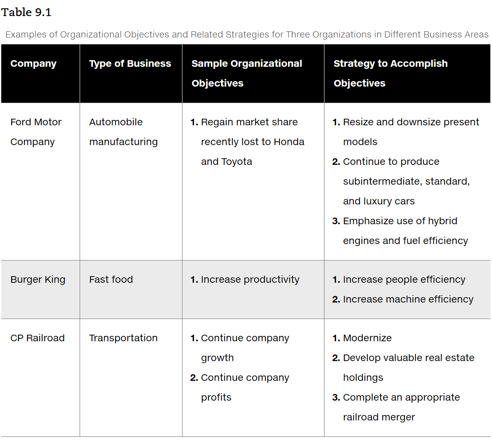
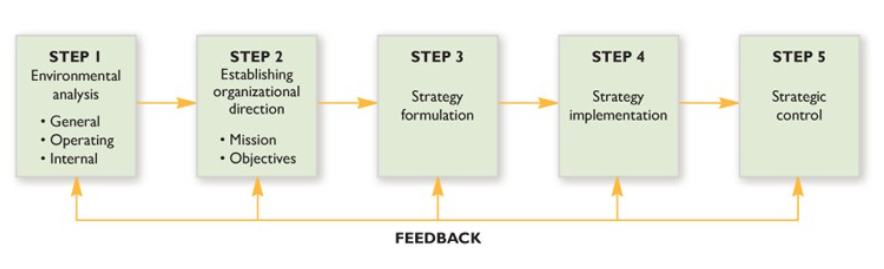
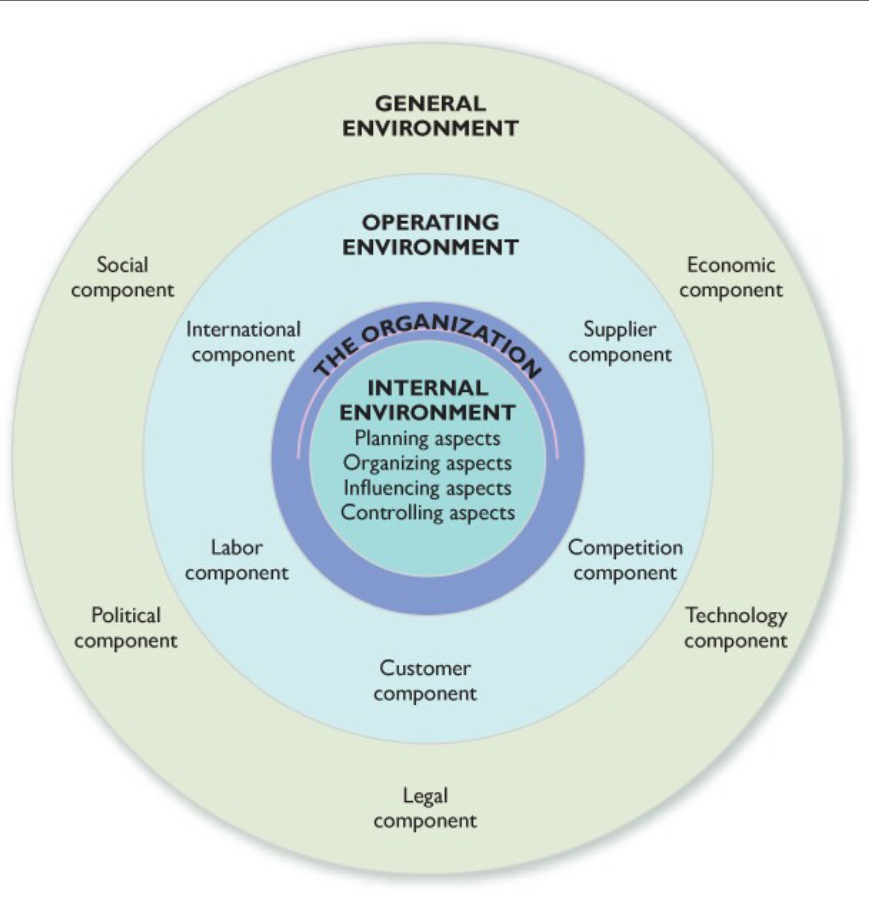
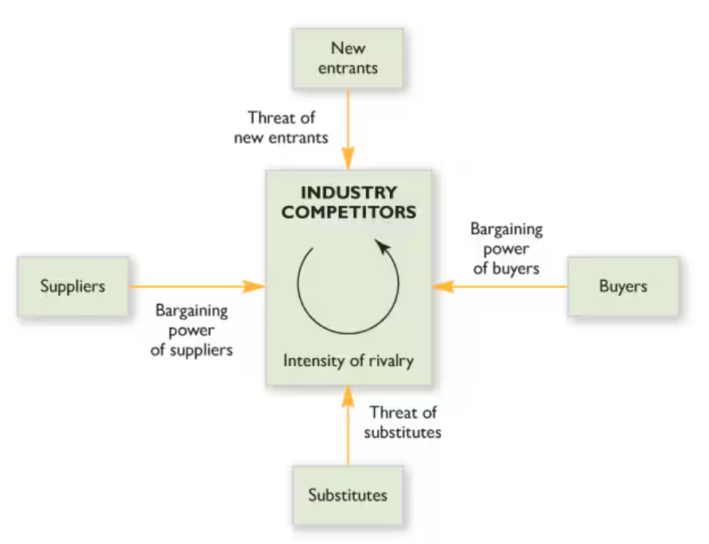

# 9.1- Definitions of strategic planning
	- **Strategic planning** is long range planning that focuses on the organization as a whole
		- Managers consider the organization as a total unit and ask themselves what must be done in the long term in order to attain organizational goals
		- 3-5 years in the future
	- **Commitment principle** managers should commit funds for planning only if they can anticipate in the foreseeable future, a return on planning expenses as a result of long-range planning analysis
	- **Strategy** defined as a broad and general plan developed to reach long term objectives
	- Larger orgs tend to be more precise in developing org strategy than smaller orgs are, all orgs should have a strategy of some sort
		- Must be consistent with org objectives
	- {:height 636, :width 575}
- # 9.2- Strategic Management Process
	- **Strategic management** process of ensuring that an organization possesses and benefits from the use of an appropriate organizational strategy
	- Strategic management process:
		- Environmental analysis
		  logseq.order-list-type:: number
		- Establishment of an organizational direction
		  logseq.order-list-type:: number
		- Strategy formulation
		  logseq.order-list-type:: number
		- Strategy implementation
		  logseq.order-list-type:: number
		- Strategic control
		  logseq.order-list-type:: number
	- 
- # 9.3- Environmental Analysis
	- **Environmental analysis** the study of the organizational environment to pinpoint environmental factors that can influence organizational operations
	- A manager must thoroughly understand how organizational enviroments are structured
	- {:height 689, :width 529}
	- ## The General Enviroment
		- **General environment:** Contains components having broad, long term implications for managing the organization
	- ### The economic component
		- Based on economics
		- Science that focuses on understanding how people of a particular community or nation produce, distribute and use various goods and services
		- Can significantly influence the environment in which a company operates and the ease or difficulty the organization experiences in attempting to reach objectives
		- Sould reflect the economic issues in the organizations enviroment
	- ### The Social component
		- **Demographics:** statistical characteristics of a population
			- Changes in numbers of people and income distributions among various population segments
		- #+BEGIN_EXAMPLE
		  Demand for retirement housing would probably increase dramatically if both the number and the income of retirees in a particular market area doubled. Effective organizational strategy would include a mechanism for dealing with a probable increase in demand within the org environment
		  #+END_EXAMPLE
		- Managers need awareness of the demographics of the groups from which employees will be hired
		- SWP - helps organizations identify the workforce they need to achieve strategic goals
		- Recession caused many employers to use wait-and-see
		- **Social values:** relative degrees of worth that a society places on the ways in which it exists and functions
			- Changes alter the organizational enviroment
			- Changes in how people live
			- Change is inevitable
	- ### The political component
		- Part of the general environment related to governmental affairs
		- Examples include the type of government in existence, gov attitude towards industries, lobbying, etc
	- ### The legal component
		- Part of the general environment that contains passed legislation
		- Comprises the rules or laws that society members must follow
		- Clean air act, Occupational Safety and Health Act, Affordable Care Act, Consumer Products Safety
		- New laws passed, some old laws amended or eliminated
	- ### The Technology Component
		- Part of the general environment that includes new approaches to producing goods and services
		- New procedures and equipment
			- Increasing use of robots in the next decade should improve US industry efficiency
	- ### The International Component
		- Operating environment segment that is composed of all factors relating to the international implications of organizational operations
		- Other countries laws, cultures, politics
	- ## The Industry Enviroment
		- **Five forces model** perhaps the best known tool for industry analysis
			- Outlines the primary forces that determine competitiveness within an industry and illustrates how those forces are related
		- **Threat of new entrants:** threat of new firms entering the market
		- **Buyer power:** power that customers have over firms operating in an industry
		- **Supplier power:** power that suppliers have over firms operating in industry
		- **Threat of substitute products:** extent to which customers use products or services from another industry instead of focal industry
		- **Intensity of Rivalry:** refers to the intensity of competition among the organizations in an industry
		- {:height 515, :width 570}
		- **Internal environment:** Level of an organizations environment that exists inside the organization and normally has immediate and specific implications for managing the organization
- # 9.4- Establishing Organizational Direction
	- Second step of the strategic management process
	- ## Determining organizational mission
		- **Organizational mission:** the purpose for which- the reason why an-organization exists
		- Reflects information such as what types of products or services it produces
		- Broad statement of organizational direction
	- ## Developing a mission statement
		- **Mission statement:** written document developed by management, normally based on input by managers as well as nonmanagers, the describes and explains the mission of the organization
	- ## Importance of an Organizational Mission
		- Helps to increase the probability that the organization will be successful
			- Helps management direct effort in common direction
				- Makes explicit the major targets that the organization is reach and helps managers
			- Serves as rational for allocating resources
			- Mission statement helps management define broad but important work areas within and organization and therefore the critical jobs
	- ## Relationship between mission and objectives
		- Targets toward which the open management system is directed
		- Sound organizational objectives reflect and flow naturally from the purpose of the organization, expressed in a mission statement
- # 9.5- Strategy Formulation: Tools
	- **Strategy formulation:** process of determining appropriate courses of action for achieving organizational goals and accomplishing org purpose
	- Tools that managers can use:
		- Critical question analysis
		- SWOT analysis
		- Business portfolio analysis
	- Related but distinct
	- Should use best for the job \rarr or a combination of tools
	- ## Critical Question Analysis
		- **Critical question analysis:** synthesis of the ideas of several contemporary management writers suggests that formulating an appropriate organizational strategy
		- **What are the purpose and objectives of the organization?**
		- **Where is the organization presently going?**
		- **In what kind of environment does the organization now exist?**
		- **What can be done to better achieve organizational objectives in the future?**
	- ## SWOT Analysis
		- **SWOT Analysis:** a strategic development tool that matches internal organizational strengths and weaknesses with external opportunities and threats
		- **Strengths, Weaknesses, Opportunities, Threats**
	- ## Business Portfolio Analysis
		- **Business portfolio analysis** an organizational strategy formulation technique that is based on the philosophy that organizations should develop strategy much as they handle investment portfolios
	- ### The BCG Growth-Share Matrix
		-