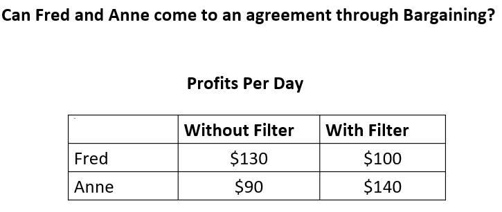
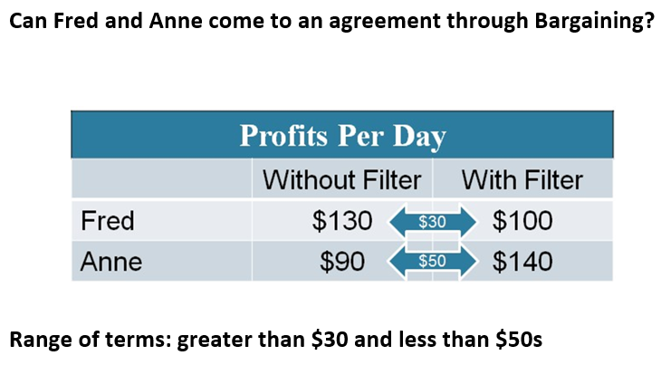
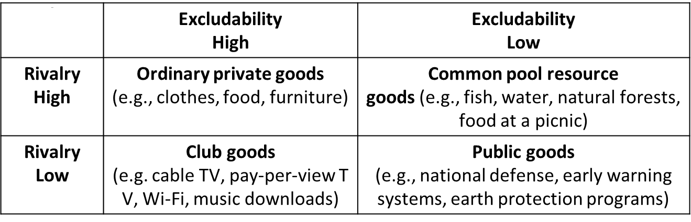

# Externalities
- **Externalities**: An externality occurs when an economic activity has either a spillover cost or a spillover benefit for a bystander
	- **Spillover:**  Unintended and indirect effect of an economic activity that impacts a third party that is not directly involved in the transaction
	- #+BEGIN_EXAMPLE
	  Ex: firms pollute when they produce goods for us to consume
	  #+END_EXAMPLE
	- **Negative externality:** An economics activity that has a negative spillover effect
	- **Positive externality:** An economic activity that has a positive spillover effect
- ## Externality benefits
	- Social benefits of education (positive externality)
	- Higher individual wages = more tax revenues
	- Less reliance on social programs
	- Decreased crime
	- More innovation
	- Better functioning society
- ## Market outcomes and solutions
- ### Market outcomes
	- When externalities are present, the free market outcome is inefficient
		- When there are negative externalities present, free markets produce and consume too much
		  logseq.order-list-type:: number
		- When there are positive externalities present, free markets produce and consume too little
		  logseq.order-list-type:: number
	- How can we address inefficient outcomes
	- Private solutions
	- Government solutions
- ### Private solutions to externalities
	- #+BEGIN_EXAMPLE
	  Anne would like Fred to agree to putting a filter on his emissions pipe because this would save the brewery from having to spend so much money on purifying the water it uses. Fred has no incentive to do so since installing the filter costs his firm money, reducing its profits.
	  #+END_EXAMPLE
	- {:height 245, :width 559}
	- {:height 392, :width 616}
	- We cannot rely too much on private solutions to externalities for these reasons:
		- Transaction costs could be too high
		  logseq.order-list-type:: number
		- Property rights may not be clearly defined
		  logseq.order-list-type:: number
		- Too many agents at the bargaining table
		  logseq.order-list-type:: number
- ### Public goods
	- #+BEGIN_EXAMPLE
	  I eat an apple, can you eat it too?
	  #+END_EXAMPLE
	- **Rival goods:**  Goods that only one person can consume at a time
	- **Nonrival goods:** Goods that more than one person at a time can consume
		- Apple
		- Trout
		- Netflix
		- U.S. Army
	- **Excludable goods:** Must be paid in order to consume them
	- **Non excludable goods:** Can be consumed, even if they are not paid for
	- 
	- #+BEGIN_EXAMPLE
	  How much are you willing to pay for national defense?
	  What if you didn't contribute?
	  Who has to provide for the national defense?
	  #+END_EXAMPLE
	- **Free rider problem:** When a individual does not pay for a good because it is non-excludeable
	- **Solution:**  The government makes paying for it mandatory
		- Successful provision of the public good
	- #+BEGIN_EXAMPLE
	  What's the right amount of a public good?
	  #+END_EXAMPLE
	-
- ### Government Solutions to Externalities
	- Government respond to externalities in two main ways
		- Command and control policies in which the government regulates the allocation of resources
		  logseq.order-list-type:: number
		- Market based policies, in which the government provides incentives for private organizations to internalize the externality
		  logseq.order-list-type:: number
- ### Coase Theorem
	- States that private bargaining will result in an efficient allocation of resources
	- The end result is that government intervention is not necessary to solve externality problems - private bargaining can do the job
	-