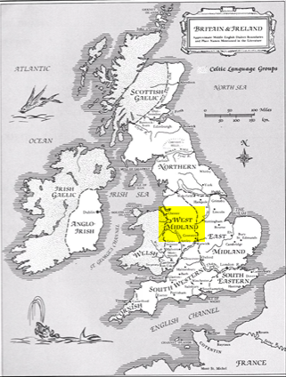
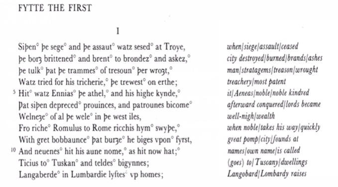
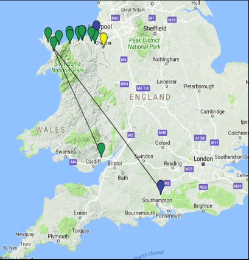

# Introduction
	- ## About the Author
		- Major languages are Latin and French
			- French was a language of International diplomacy
			- English is emerging as a common lanuage
				- Not viewed as well as the other
		- Romance of the 1380s or possibly the 1390s
		- Might have  been Alternative Revival (throw back poem)?
		- Unknown author \rarr (Gawain-poet or Pearl-poet)
			- Author perhaps a court poet for the King
			- Poem seems to come from the northwest Midlands, may have been from Cheshire, where Richard II often kept his court
				- A bit further away from London
				- There
				- {:height 396, :width 255}
			-
			- What does it mean to write the poem for the king?
	- Four poems in the Cotton Nero ax. manuscript (three are religious)
		- Pearl
		- Patience
		- Cleanness
		- Sir Gawain and the Green Knight
	- Most of old English poetry was alternative
		- Some tie it into nationalism
		- Poem is about nationalism
	- {:height 379, :width 553}
	- **Stresses in words and stresses of alliteration in the text**
	- ## Historical Context
		- ### The Hundred Years War (1337-1454)
			- New French King Philip VI gives refuge to the Scottish King David II in 1334
				- In 1337 confiscated the Duchy of Aquitaine (hereditary possession of English Kings)
			- Edward III claims the throne of France by right of birth (through his mother following death of her brother, Charles IV)
			- English win important early victories in France at Crecy (1346) and Poitiers (1356)
				- Its not as much of a continuous war, on or off periods
- # Fitt 1
	- #+BEGIN_QUOTE
	  "Once the siege and the assault of Troy had ceased" (I)
	  "So listen a little while to my tale if you will" (30)
	  "the most chivalrous knights / the handsomest king" (51, 54)
	  "at her place on the platform, pricelessly curtained I by silk to each
	  side, and canopied across / with French weave and fine tapestry from
	  the far east" (75-77)
	  #+END_QUOTE
		- Not beginning with the English story, but rather the story of their ancestors
			- Back to the foundations
	- #+BEGIN_QUOTE
	  "He [Arthur] brimmed with ebullience being almost boyish / / His
	  blood was busy and he buzzed with thoughts" (85, 89)
	  "a mountain of a man immeasurably high, I a hulk of a human from
	  head to hips, / / I should genuinely judge him to be a half giant, / or a
	  most massive man, the mightiest of mortals" (137-38, 140).
	  "otherworldly, yet flesh / and bone" (198)
	  #+END_QUOTE
		- Presented as a youthful king
		- Should be assumed to be a massive man/ half gaint
			- Not quite a giant, but a massive man
			- Almost supernatural but not quite
		- Almost a king of Beowulf figure
	- #+BEGIN_QUOTE
	  "They gaped and they gawked" (232)
	  "were like statues in their seats, / left
	  speechless and rigid, not risking a
	  response" (241-42)
	  #+END_QUOTE
		- The audience is shocked
	- #+BEGIN_QUOTE
	  "because your acclaim is so loudly chorused,
	  And your castle and brotherhood are called the best,
	  the strongest men to ever mount the saddle,
	  the worthiest knights ever known to the world,
	  both in competition and true combat,
	  and since courtesy is championed here,
	  I'm intrigued, and attracted to your door at this time."
	  (258-63).
	  #+END_QUOTE
		- Courtesy is paramount here
		- The strongest, worthiest, the most chivalrous
	- #+BEGIN_QUOTE
	  "Besides, / the bodies on these benches are just bum-fluffed
	  bairns [children]" (279-80)
	  "So who has the gall? The gumption? The guts?" (291)
	  "So here is the House of Arthur," he scoffed" (309).
	  #+END_QUOTE
		- There is a sense because he wants to offer the best, right, this challenge
		- Knights and youth
		- Throws down the contest with the axe
			- Due to claim to be the best
			- Looking for someone in the room to come forward and challenge him, but no one does
	- #+BEGIN_QUOTE
	  "Then Arthur grips the axe,
	  grabs it by its haft / and takes
	  it above him, intending to
	  attack" (330-31
	  "Gawain / now to his king
	  inclines / and says, "I stake
	  my claim. / This moment
	  must be mine" (339-42).
	  #+END_QUOTE
		- Takes the axe and intends to attack
		- Too prestigious for this sort of game
		- This moment must be mine
	- #+BEGIN_QUOTE
	  "you must solemnly swear
	  that you'll seek me yourself, that you'll search me out
	  to the ends of the earth to earn the same blow
	  as you'll dole out today in this decorous hall."
	  (394-97)
	  "You're charged with getting to the Green Chapel" (451).
	  [oaths/reciprocity] "reap what you've sown" (452)
	  #+END_QUOTE
		- The terms are clear
		- What is this contest
- # Fitt 2&3
	- Laugh and grin with the green man gone \rarr almost a celebration
		- The wall is hung on the wall as a sort of symbol of thier joy
	- #+BEGIN_QUOTE
	  for men might be merry when addled with mead / but each
	  year, short lived, is unlike the last" (497-98)
	  (566-669) long, descriptive passage that diverges from the main
	  narrative
	  #+END_QUOTE
		- A passage diverges from the main narrative just to tell us how to lose the passage of time
			- Trying to go find the green knight
			- Serves to Heighten tension
	- ## Themes
		- The pentangle (the endless knot) \rarr Five fives
			- Five senses
			  logseq.order-list-type:: number
				- Through the senses we can be tempted
				  logseq.order-list-type:: number
			- Five fingers
			  logseq.order-list-type:: number
				- Can resist temptation
				  logseq.order-list-type:: number
			- Five wounds
			  logseq.order-list-type:: number
				- Christs crucifiction
				  logseq.order-list-type:: number
			- Five joys
			  logseq.order-list-type:: number
				- Joys of  Mary
				  logseq.order-list-type:: number
			- Five virtues
			  logseq.order-list-type:: number
		- The five joys of Mary \rarr part of the pentagonal
			- Annuciation
			  logseq.order-list-type:: number
				- Coming birth of christ
				  logseq.order-list-type:: number
			- Nativity
			  logseq.order-list-type:: number
				- Birth of christ
				  logseq.order-list-type:: number
			- Resurrection
			  logseq.order-list-type:: number
				- Ressurected
				  logseq.order-list-type:: number
			- Ascension
			  logseq.order-list-type:: number
				- Ascension of Christ
				  logseq.order-list-type:: number
			- Assumption
			  logseq.order-list-type:: number
		- Five virtues
			- Generosity (friendship)
			  logseq.order-list-type:: number
			- Fellowship (fraternity)
			  logseq.order-list-type:: number
			- Chastity (purity)
			  logseq.order-list-type:: number
			- Courtesy (politeness)
			  logseq.order-list-type:: number
			- Compassion (pity)
			  logseq.order-list-type:: number
	- #+BEGIN_QUOTE
	  "To find his equal on earth would be far from easy.
	  Cleverer to have acted with caution and care,
	  deemed him a duke—a title he was due—
	  a leader of men, lord of many lands;
	  better that than being battered into oblivion,
	  beheaded by an ogre through headstrong pride.
	  How unknown for a king to take counsel of a knight
	  in the grip of an engrossing Christmas game."
	  (476-83)
	  #+END_QUOTE
	- #+BEGIN_QUOTE
	  "He wanders near to the north Of Wales
	  with the Isles of Anglesey off to the left.
	  He keeps to the coast, fording each course,
	  crossing at Holy Head and coming ashore
	  in the wilds of the Wirral, whose wayward people
	  both God and good men have quite given up on."
	  (697-702)
	  #+END_QUOTE
		- 
	- The person who was beheaded head falls and where is falls water springs up
	- They have gone to this kind of dangerous wilderness
	- #+BEGIN_QUOTE
	  "Father, hear me, / and Lady Mary, our mother most mild, / let
	  me happen on some house where mass might be heard, / and
	  matins in the morning" (753-56)
	  #+END_QUOTE
		- Is miserable and prays to god that things can get better
	- #+BEGIN_QUOTE
	  "The knight had not seen a more stunning structure" (793).
	  "Then he went on his way, but came back at once / with a group who had
	  gathered to greet the stranger; I the drawbridge came down and they crossed
	  the ditch / and knelt in the frost in front of the knight" (815-18).
	  "Curtains ran on cors through red-gold rings, / tapestries from Toulouse and
	  Turkistan / were fixed against walls and fitted underfoot" (858-59).
	  "She was the fairest amongst them I / more glorious than Guinevere, or
	  so Gawain thought" (943, 945)
	  #+END_QUOTE
		- The men who he encounters respect him
		- The castle that he encounters is similar to Arthurs court mentioned at the beginning of the story
		- A beautiful wife and an amazing castle
	- #+BEGIN_QUOTE
	  "Once the master has gathered that his guest is Gawain
	  he thinks it so thrilling he laughs out loud.
	  All the men in the manor were of the same mind,
	  being keen and quick to appear in his presences,
	  this person famed for prowess and purity,
	  whose noble skills were sung to the skies,
	  whose life was the stuff of legend and lore.
	  **Then knight spoke softly to knight, saying
	  "Watch now, we'll witness his graceful ways,
	  hear the faultless phrasing of flawless speech"
	  (908-918)**
	  #+END_QUOTE
		- Told of how young the lord is
		- Hear about his great reputation, partially out of courtesy
		- The green knight arrives to see if it is true
	- #+BEGIN_QUOTE
	  "The place you need is near, I
	  two miles at most away" (1077-78).
	  "Here's a wager: what I win in the
	  woods will be yours, / and what
	  you gain while I'm gone you will
	  give to me" (1106-7).
	  #+END_QUOTE
		- Given a great room and warm clothes
		- This place is a dream
		- The place that he wants to find is the Green Chapel
			- Only 2 miles ahead
		- Celebrate Christmas before he heads to the green chapel
		- Another example of reciprocity
	- #+BEGIN_QUOTE
	  "so through a lime-leaf border the lord led the
	  hunt, / while snug in his sheets lay slumbering
	  Gawain" (1178-79)
	  "You're tricked and you're trapped!" (1210)
	  "Gawain is a gentleman and remains on guard"
	  (1282).
	  "But I know that Gawain could never be your
	  name" (1293).
	  #+END_QUOTE
		- Lord goes out on a hunt for deer while Gawain is sleeping in his bed
		- Innocent kiss
	- #+BEGIN_QUOTE
	  "Are you pleased with this pile? Have
	  I won your praise?" (1379-80)
	  "So he held out his arms and hugged
	  the lord / and kissed him in the
	  kindliest way—to my one profit, I
	  though I'd gladly have given you any
	  greater prize" (1388-91)
	  #+END_QUOTE
		- *effictio*- the dressing of the deer
		- "Holds out his arms and hugged the lord"- "and kissed him"
	- ## Other historical information
		- Medieval Canonical Hours
			- |Name|Equivalent|
			  |--|--|
			  |Matins|3 AM|
			  |Lauds|5 AM/Sunrise|
			  |Prime|6 AM|
			  |Terce |9 AM|
			  |Nones|3 PM|
			  |Vespers|6 PM|
			- Eversong would have been a service of religious songs
			- Told about this through a variety of liturgical books
- # Fitts 3&4
	- #+BEGIN_QUOTE
	  "the biggest of wild boars has bolted
	  from his cover" (1441)
	  "So the day was spent in pursuits of this
	  style, / while our lovable young lord had
	  not left his bed" (1468-69)
	  #+END_QUOTE
	-